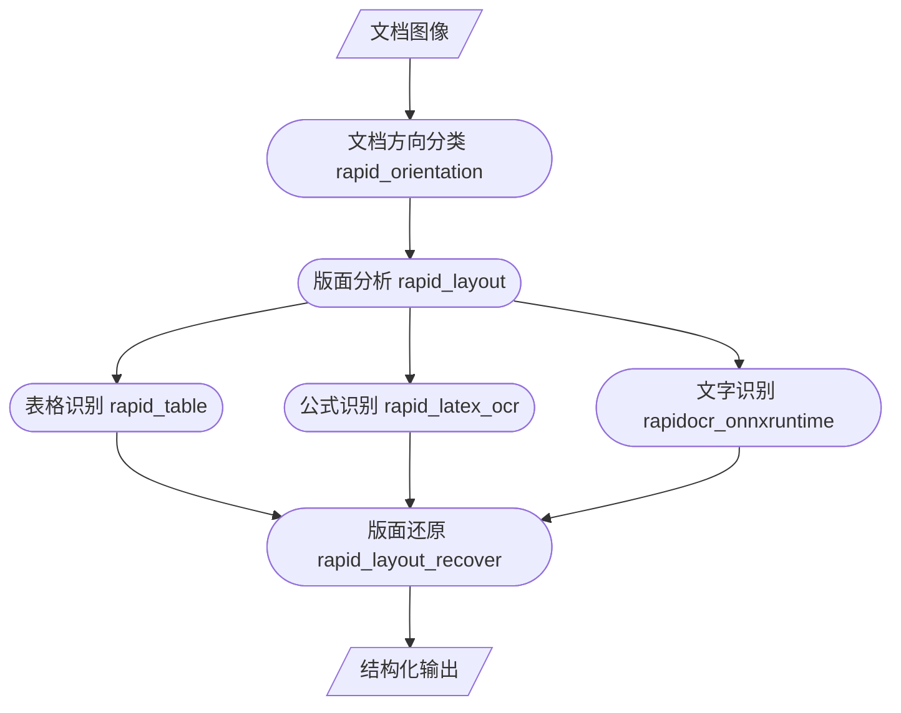

<div align="center">
  <div align="center">
    <h1><b>📃 Rapid Doc</b></h1>
  </div>

<a href="https://swhl-rapidstructuredemo.hf.space" target="_blank"></a>
<a href="">=3.6,<3.12-aff.svg"></a>
<a href=""></a>
<a href="https://pepy.tech/project/rapid-layout"></a>
<a href="https://pepy.tech/project/rapid-orientation"></a>
<a href="https://pepy.tech/project/rapid-table"></a>
<a href="https://semver.org/"></a>
<a href="https://github.com/psf/black"></a>

</div>

>
> ## 🚀 Work In Progress
>
> 整体功能还没开发完哈！欢迎加入一起搞

## 📝 简介

该项目主要针对文档类图像做内容提取，将文档类图像一比一输出到Word或者Txt中，便于进一步使用或处理。后续计划支持输入PDF/图像，输出对应json格式、Txt格式、Word格式和Markdown格式。

## 🛠️ 整体框架

以下为整体框架依赖包，均为RapidAI出品。

- [rapid_orientation](https://github.com/RapidAI/RapidStructure/blob/main/docs/README_Orientation.md)
- [rapid_layout](https://github.com/RapidAI/RapidLayout)
- [rapid_table](https://github.com/RapidAI/RapidTable)
- [rapid_latex_ocr](https://github.com/RapidAI/RapidLatexOCR)
- [rapidocr_onnxruntime](https://github.com/RapidAI/RapidOCR)
- [rapidocr_layout_recover](https://github.com/RapidAI/RapidDoc)



## 📑 输入和输出

- 输入：文档类图像
- 输出：TXT或Word

## 💻 安装运行环境

```bash
pip install -r requirements.txt
```

## 🚀 运行Demo

```bash
git clone https://github.com/RapidAI/RapidDoc.git
cd RapidDoc
python demo.py
```

## 📈 结果示例

⚠️注意：之所以提取结果没有分段，是因为版面分析模型没有段落检测功能。现有开源的所有版面分析模型都没有段落检测功能，这个后续会考虑自己训练一个版面分析模型来优化这里。

<div aligin="left">
  

</div>

## ⭐ Star History

<a href="https://star-history.com/#RapidAI/RapidDoc&Date">
 <picture>
   <source media="(prefers-color-scheme: dark)" srcset="https://api.star-history.com/svg?repos=RapidAI/RapidDoc&type=Date&theme=dark" />
   <source media="(prefers-color-scheme: light)" srcset="https://api.star-history.com/svg?repos=RapidAI/RapidDoc&type=Date" />
   
 </picture>
</a>
